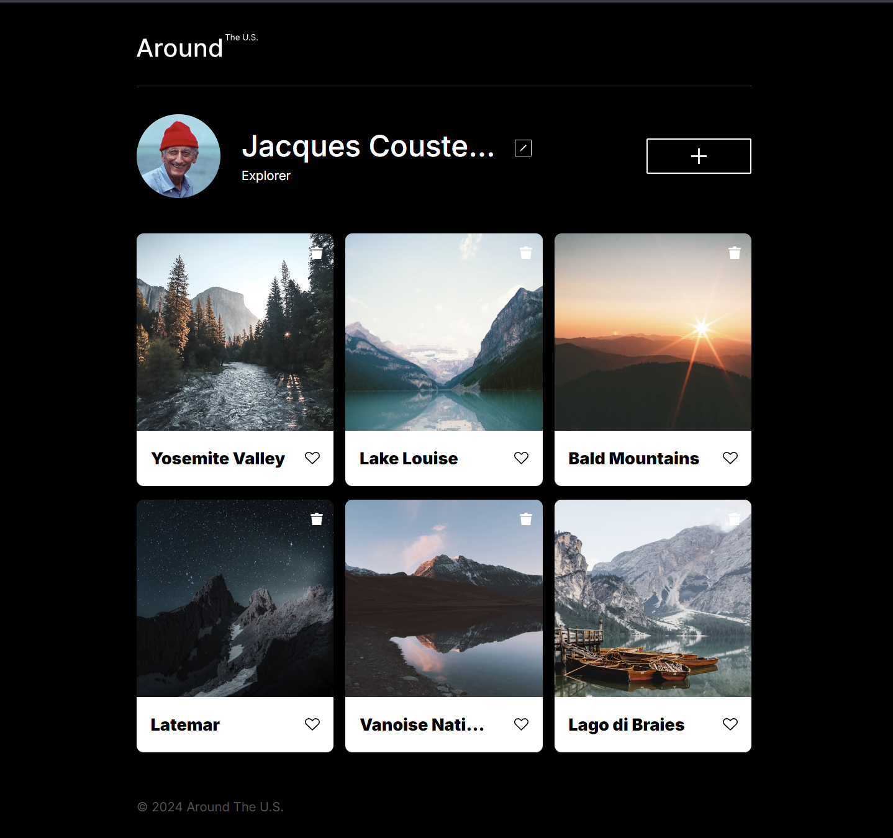
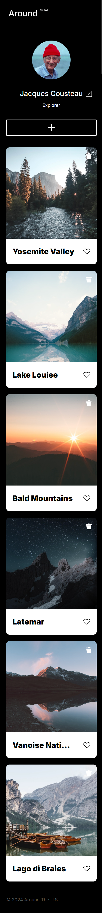

# Project 3: Around The U.S.

### Overview  

* Intro  
* Figma  
* GitHub
* Images  
* Improvement 
* Video
  
**Intro/Description**
  
This project is made so all the elements are displayed correctly on popular screen sizes. It consists on creating a user profile for "320px" and "1280px" screens with the user picture, an "edit" and "add" buttons(to be able to update the profile info) in the header of the page and then the content shows the pictures of the places that the user have visited contained in cards with a desctiption of the photo and a like button(to be able to like it if preffered) next to it.
  
**Technologies used**

* Figma
* GitHub
* HTML
* CSS
* VSCode

**Figma**  
  
* [Link to the project on Figma](https://www.figma.com/file/ii4xxsJ0ghevUOcssTlHZv/Sprint-3%3A-Around-the-US?node-id=0%3A1)  
  
**GitHub**
* [Link to the project on GitHub](https://obito2912.github.io/se_project_aroundtheus/)  

**Images**  

Here is an sample of how the website looks like in both resolutions(320px-1280px): 
  
 

**Improvement**

When the structure is done the project will be improved by using JavaScript so the user can be able to actually used the buttons on the website.

**Video**

